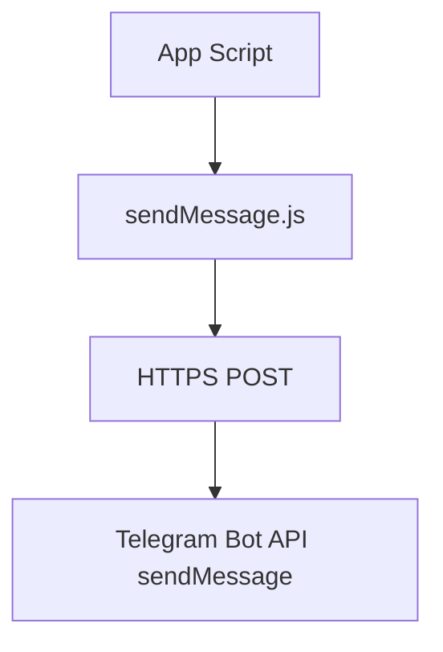
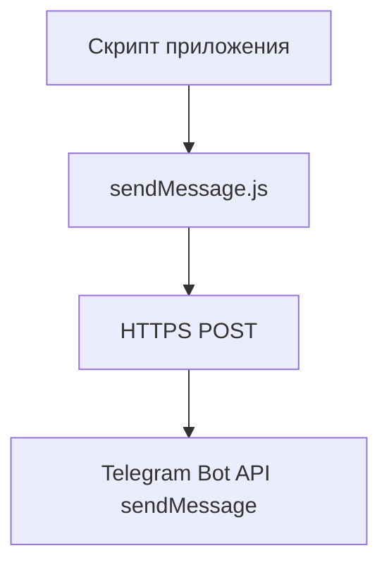

# TestBotTelegram

## English

## Problem
Projects often need a reusable utility for sending Telegram notifications from scripts and lightweight services.

## Solution
`TestBotTelegram` provides a simple `sendMessage` module that posts messages to Telegram Bot API with minimal setup.

## Tech Stack
- Node.js
- JavaScript (CommonJS)
- Axios
- Telegram Bot API

## Architecture
Top-level structure:
```text
sendMessage.js
package.json
netlify/
netlify.toml
```



## Features
- Send text messages to Telegram chats
- Tiny reusable module for other projects
- Uses `BOT_TOKEN` from environment

## How to Run
```bash
npm install
cp .env.example .env
node -e "const send=require('./sendMessage'); send(123456789,'Hello from TestBotTelegram')"
```

## Русский

## Проблема
Во многих проектах нужен переиспользуемый модуль для отправки Telegram-уведомлений из скриптов и легковесных сервисов.

## Решение
`TestBotTelegram` предоставляет простую функцию `sendMessage`, которая отправляет сообщения в Telegram Bot API с минимальной настройкой.

## Стек
- Node.js
- JavaScript (CommonJS)
- Axios
- Telegram Bot API

## Архитектура
Верхнеуровневая структура:
```text
sendMessage.js
package.json
netlify/
netlify.toml
```



## Возможности
- Отправка текстовых сообщений в Telegram-чаты
- Минимальный модуль для повторного использования
- Использование `BOT_TOKEN` из окружения

## Как запустить
```bash
npm install
cp .env.example .env
node -e "const send=require('./sendMessage'); send(123456789,'Hello from TestBotTelegram')"
```
